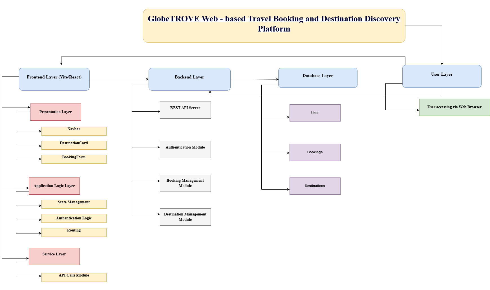
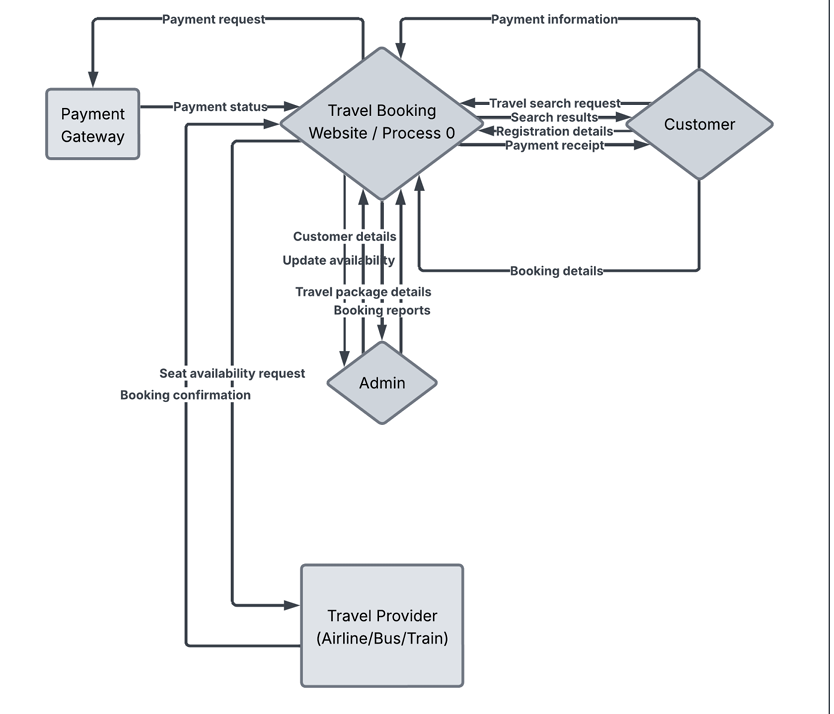
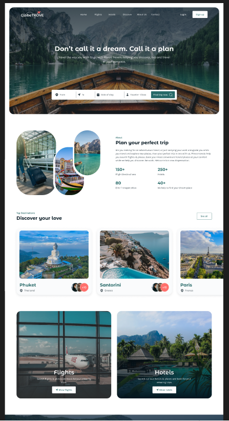
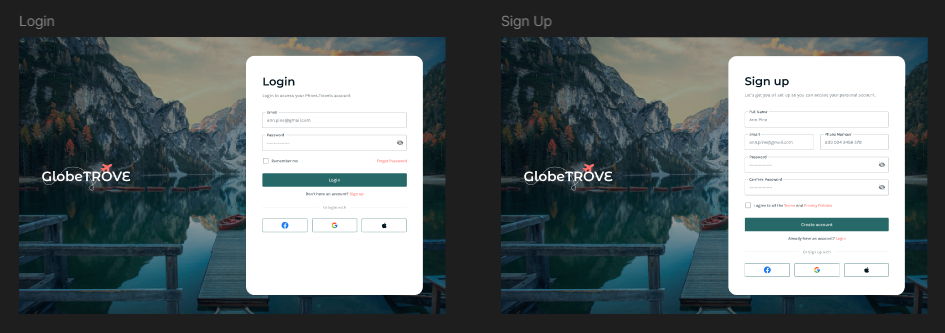

#  GlobeTrove – Travel Booking & Destination Discovery Platform
## Deployed site :  https://globetrove.vercel.app/
##  Project Overview
GlobeTrove is a web-based travel booking and destination discovery platform designed to simplify how users explore, plan, and book travel experiences. It provides curated destinations, transparent pricing, secure booking, and immersive previews such as virtual tours, all within a single unified interface.

---

##  Problem It Solves
Modern travelers face:
- Fragmented travel planning across multiple platforms
- Information overload and lack of curated recommendations
- Poor mobile experiences during booking
- Limited trust due to lack of authentic previews

GlobeTrove solves these by offering a centralized, user-friendly, and trustworthy travel booking experience.

---

## Target Users (Personas)

###  Persona 1: Budget Traveler (Student / Young Professional)
- Age: 18–30  
- Goals: Affordable trips, easy booking, clear pricing  
- Pain Points: Too many platforms, confusing interfaces  

###  Persona 2: Travel Enthusiast
- Age: 25–45  
- Goals: Discover unique destinations, immersive previews  
- Pain Points: Generic listings, lack of inspiration  

###  Persona 3: Platform Administrator
- Goals: Manage destinations, bookings, and users  
- Pain Points: Manual tracking, lack of centralized control  

---

##  Vision Statement
“To create a seamless, trustworthy, and engaging travel platform that empowers users to discover and book memorable travel experiences effortlessly.”

---

##  Key Features / Goals
- Secure user authentication and profile management
- Destination discovery with search and filters
- Wishlist and booking cart
- Secure online payment integration
- Booking history and confirmations
- Admin dashboard for content and user management
- Virtual tours and rich media (optional)

---

##  Success Metrics
- 80% of users complete booking without assistance
- Successful payment transactions with zero critical failures
- Average page load time under 3 seconds
- Positive usability feedback from test users

---

##  Assumptions & Constraints

### Assumptions
- Users have internet access and basic web literacy
- Users are willing to create accounts
- Third-party services (PayPal, hosting) are reliable

### Constraints
- Academic project timeline
- Open-source / free tools only
- Student-level development resources
- Compliance with data security standards

> Feature branch: authentication setup


## Figma Wireframes
Figma link: https://www.figma.com/design/J8QhVYW5wu50TCJSuWNJBU/GlobeTROVE?node-id=0-1&t=exKy3OFqTz2SvxE3-1

## Draw.io Wireframes
Draw.io link: https://drive.google.com/file/d/1_gQeV6JScSTqGtbJ7caM6T8teWhBu5sF/view?usp=sharing

## Quick Start – Local Development

### Prerequisites
- Git
- Docker Desktop
- VS Code

### Run Locally Using Docker
The application is containerized using a multi-stage Docker build and served via NGINX inside a production container.
```bash
docker-compose up --build
```

---


## Software Design

#### Architecture Diagram



.png)


#### UI/UX Designs

.png)
.png)




GlobeTROVE was designed using a client–server architecture with a layered frontend structure to ensure clear separation of concerns. The system emphasizes modularity by organizing features into independent modules such as authentication, booking, and destination management. Abstraction was applied through a dedicated service layer for API communication, keeping UI components independent from backend logic. High cohesion and low coupling were maintained by ensuring each module has a single responsibility and minimal dependencies. These design choices improve scalability, maintainability, and ease of future enhancements.